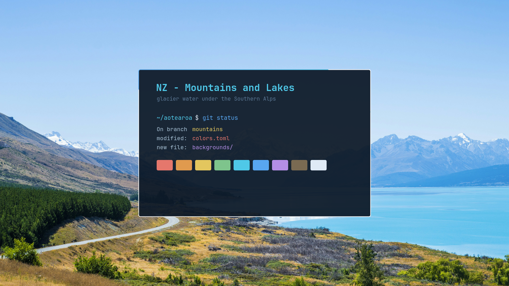

# NZ - Mountains and Lakes

A dark theme for [Omarchy](https://omarchy.org), drawn from glacier-fed water
under the Southern Alps.



The palette was sampled from the photographs themselves rather than invented:
lake at depth for the backgrounds, glacial meltwater for the accent, snow for
text, and tussock gold and alpenglow red for the warm signal colours so the
blues stay dominant. Every foreground colour clears 4.5:1 contrast against the
background.

It is the alpine companion to
[NZ - Forest](https://github.com/Orrok/omarchy-nz-forest-theme).

## Install

```bash
omarchy theme install https://github.com/Orrok/omarchy-nz-mountains-and-lakes-theme.git
omarchy theme set "NZ Mountains And Lakes"
```

Omarchy strips the `omarchy-` prefix and `-theme` suffix from the repository
name, so the theme installs as `nz-mountains-and-lakes`.

## What is in it

| File | Purpose |
|------|---------|
| `colors.toml` | The palette and the border gradient. Omarchy generates the terminal, editor, btop and shell themes from this. |
| `hyprland.lua` | Near-sharp corners, alpine haze blur, distance dimming and a tight shadow. |
| `icons.theme` | Yaru Blue icon theme. |
| `chromium.theme` | Browser frame tint. |
| `unlock.png` | The Omarchy wordmark, recoloured to the accent. |
| `backgrounds/` | Ten photographs, every one 3840px wide or larger. |

Filenames in `backgrounds/` are zero-padded on purpose. Omarchy sorts them with
the locale's collation, which ignores hyphens, so an unpadded `10-` would sort
ahead of `1-` and the intended first wallpaper would never lead.

### Shape, not just colour

The [forest theme](https://github.com/Orrok/omarchy-nz-forest-theme) rounds its
corners generously because nothing in a forest is square. This one deliberately
does the opposite. Mountains and ice are angular, so corners sit at 4px, the
drop shadow is tight and hard like high-altitude light, and blur on the bar and
menus stands in for the haze over a cold lake. Unfocused windows dim by 0.18 so
they fall back the way a distant range fades.

### The border gradient

`colors.toml` sets one optional key that does more work than the rest:

```toml
hyprland_active_border = "accent blue 45deg"
```

Omarchy resolves those names against the palette and feeds the result into both
the Hyprland window border and every shell surface, so notifications, popups,
menus, the launcher and the lock screen all carry the same meltwater-to-deep-lake
shift.

### A note for anyone installing from this repository

Omarchy will not run code from a cloned theme, so it discards `hyprland.lua` on
install. The border gradient is deliberately defined in `colors.toml` instead,
which is never stripped, so it survives. What a cloned install loses is the
corner rounding, the blur, the dimming and the shadow. Add them back in your own
`~/.config/hypr/looknfeel.lua`:

```lua
hl.config({
  decoration = {
    rounding = 4,
    dim_inactive = true,
    dim_strength = 0.18,
    blur = { enabled = true, size = 6, passes = 2 },
  },
})
```

This is a deliberate safety measure in Omarchy, not a fault in the theme.

## Photographs

Ten backgrounds by ten photographers, used under the
[Unsplash License](https://unsplash.com/license). Full attribution, including a
link to every photographer and every original photograph, is in
**[CREDITS.md](CREDITS.md)**. The same credit is embedded in each JPEG, so it
travels with the file.

## Licence

Theme files are MIT, see [LICENSE](LICENSE). The photographs are not; they
belong to their photographers.
